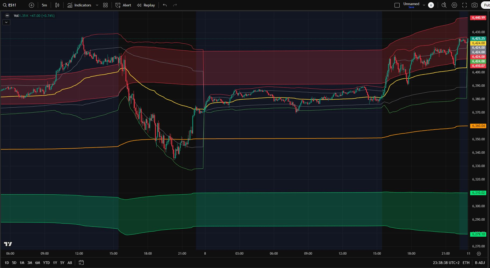

# VWAP Combo: Weekly + Fibonacci Bands & Daily + Standard Deviation Bands

A **TradingView Pine Script** that combines **two VWAP-based analysis methods** into one flexible indicator:

1. **V1** — Weekly VWAP with Fibonacci-based standard deviation bands.
2. **V2** — Daily VWAP with standard deviation bands.

This suite is built for traders who want to track both macro (weekly) and micro (daily) price positioning against dynamic VWAP anchors.

---

## 📸 Screenshot

---

## ✨ Features

- **Two independent VWAP modes**:
  - **V1**: Weekly VWAP + ±Fibonacci SD bands
  - **V2**: Daily VWAP + ±Standard deviation bands
- **Customizable Parameters**:
  - Fibonacci multipliers for V1
  - Standard deviation multipliers for V2
  - Color schemes and fill transparency
- **Bar Coloring**:
  - Highlight bullish/bearish conditions for each VWAP mode
- **Previous VWAP Option**:
  - Show prior daily VWAP for intraday reference

---

## 📎 Direct TradingView Access

You can add this indicator to your TradingView chart directly from the public library:  
**[VWAP Combo: Weekly + Fibo & Daily + Stand dev](https://www.tradingview.com/script/4QzabT8i-VWAP-Combo-Weekly-Fibo-Daily-Stand-dev/)**

My TradingView profile: **[EmotionalTrader777](https://www.tradingview.com/u/EmotionalTrader777/)**

---

## 🛠 How It Works

### **V1 – Weekly VWAP + Fibonacci Bands**
- VWAP resets at the start of each week.
- Standard deviation of price around VWAP is calculated.
- Fibonacci multipliers (`fib1`, `fib2`) define the upper/lower band distances.
- Useful for **macro trend anchoring** and spotting stretched price conditions.

### **V2 – Daily VWAP + Standard Deviation Bands**
- VWAP resets at the start of each day.
- Two sets of ±standard deviation bands define near-term price extremes.
- Optional previous-day VWAP plotting for intraday bias reference.

---

## ⚡ Use Cases

- **Support & Resistance**:  
  VWAP bands act as dynamic S/R levels.
- **Trend Context**:  
  Price location relative to weekly/daily VWAP helps define bias.
- **Volatility Analysis**:  
  Standard deviation bands adapt to volatility conditions.
- **Trade Timing**:  
  Use confluence between daily and weekly VWAP bands to find high-probability setups.

---

## 📋 Inputs

### **General**
| Input            | Description                           |
|------------------|---------------------------------------|
| Show V1          | Toggle weekly VWAP + Fibo bands       |
| Show V2          | Toggle daily VWAP + SD bands          |

### **V1 – Weekly VWAP + Fibo**
| Input            | Description                           | Default |
|------------------|---------------------------------------|---------|
| Fibo extension 1 | 1st band multiplier                   | 1.618   |
| Fibo extension 2 | 2nd band multiplier                   | 2.618   |
| Deviation filter | Only trigger if SD > threshold        | 150     |
| Colors           | VWAP line, up bands, down bands       | Custom  |

### **V2 – Daily VWAP + Stdev**
| Input            | Description                           | Default |
|------------------|---------------------------------------|---------|
| SD multipliers   | ±1st and ±2nd band multipliers         | 1.28 / 2.01 |
| Colors           | VWAP line, up fill, down fill         | Custom  |
| Show prev VWAP   | Toggle previous daily VWAP            | false   |

---

## 🎨 Color Scheme (Defaults)
- **V1 VWAP** — Orange
- **V1 Bands Up** — Red
- **V1 Bands Down** — Lime
- **V2 VWAP** — Yellow
- **V2 Bands** — Gray (inner), Red/Green (outer)

---

## 📦 Installation

### Option 1 — Add Directly on TradingView (Easiest)
Add the indicator directly from the public library:  
**[VWAP Combo: Weekly + Fibo & Daily + Stand dev](https://www.tradingview.com/script/4QzabT8i-VWAP-Combo-Weekly-Fibo-Daily-Stand-dev/)**

---

### Option 2 — Install from Code
1. Copy the code from `VWAP-Combo-Weekly-Fibo-Daily-Stdev.pine`
2. Open **TradingView**
3. Go to **Pine Editor**
4. Paste the code and click **Add to Chart**
5. Save the script to your account

---

Note on Code Origin:
The Pine Script codes were initially mostly generated with the help of large language models (LLMs) to speed up the development process. However, all trading algorithms, logic, and parameter settings are my own original work. Each indicator has been thoroughly tested and deployed on TradingView, where it’s actively used and has been tested and boosted by over 50 traders within the first days of release.

---

## 👤 Author

**EmotionalTrader**  
- Futures trader, Python learner, aspiring asset trader, horse whisperer, space cowboy  
- [TradingView Profile](https://www.tradingview.com/u/EmotionalTrader777/)  
- [GitHub](https://github.com/EmotionalTrader)

