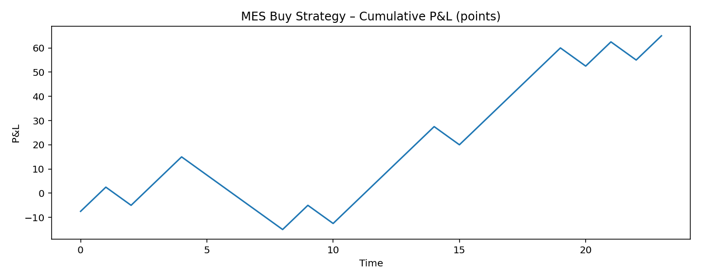

# Intraday-Trading-Tools

A curated suite of intraday trading tools for TradingView. Includes EMA–VWAP crossover signals, Rolling VWAP suites, and Daily/Weekly VWAPs.

## Executive Summary

Intraday-Trading-Tools provides TradingView indicators and reproducible Python backtests for ES/MES 3-minute intraday trading.

**Validated EMA/VWAP Crossover Buy Signal (MES)**
- 3-min bars · 2025-06-01 → 2025-08-14 · 14:30–22:00 Europe/Stockholm  
- TP 10 pts / SL 7.5 pts
- Result: **+65 pts** total · **58.3%** win · **Sharpe 3.07** · **MaxDD 30 pts**  
  [Report](reports/BUY_mes_TP10_SL7p5_1430-2200.md) · [Trades CSV](reports/BUY_mes_trades_TP10_SL7p5_1430-2200.csv) 
#### Buying Equity Curve

  

**Validated EMA/VWAP Crossover Sell Signal (MES)**

- 3-min bars · 2025-06-01 → 2025-08-14 · 14:30–22:00 Europe/Stockholm  
- TP 10 pts / SL 7.5 pts  
- Result: **+31.5 pts** total · **47.8%** win · **Sharpe 1.05** · **MaxDD 30 pts**  
  [Report](reports/SELL_mes_TP10p0_SL7p5_1430-2200.md) · [Trades CSV](reports/SELL_mes_trades_TP10_SL7p5_1430-2200.csv)

#### Short Selling Equity Curve

## Interpreting These Results (market context & risk settings)

**Test window & regime.** The period (2025-06-01 → 2025-08-14) spans US summer when liquidity is typically lower (July was especially quiet). The index was near all-time highs and drifting upward.  
**Implication:** More false-flag signals, muted intraday volatility, and a headwind for short setups. The chosen bracket (TP 10 / SL 7.5) is intentionally conservative and fits this regime well, those with bigger risk appetites can consider bigger position sizes.

**Scope.** This repo shows the baseline logic and reproducible results. More advanced variations and stress tests are developed privately.

## Note on Code Origin
The Pine Script indicators code were initially generated with help from large language models (LLMs) to accelerate development. All trading algorithms, logic, and parameter settings are my own original work. Each indicator has been tested and deployed on TradingView, where it was used and boosted by 50+ traders within the first days of release. References/proof can be provided by email upon request; however, to respect privacy and data-protection laws, they will not be published in this public repository. I prefer to develop my algorithms and trading strategies in a private, focused environment.

## Additional Information

### ⚠️ Disclaimer
This software and its indicators are provided for educational and informational purposes only and do not constitute financial advice. Trading involves significant risk, and many individuals lose money—especially in futures. Use these tools at your own risk, and consult a qualified financial advisor before making any trading decisions.

### Instrument Suitability
These indicators are primarily built for S&P 500 futures (ES and MES) but can be suitable for other instruments depending on your strategy and testing.

Trading S&P 500 futures based solely on indicators is not recommended. For better decision-making:
- Use **support and resistance levels** as your primary basis.
- Consider **price action and pattern breakouts** as a secondary basis.
- Use indicators (like those provided here) as a tertiary input.
- Before entering a position, check **RSI (Relative Strength Index)** to gauge overbought/oversold conditions.

### 👤 Author — **EmotionalTrader**
- Futures trader, Python learner, aspiring asset trader  
- [GitHub](https://github.com/EmotionalTrader)

