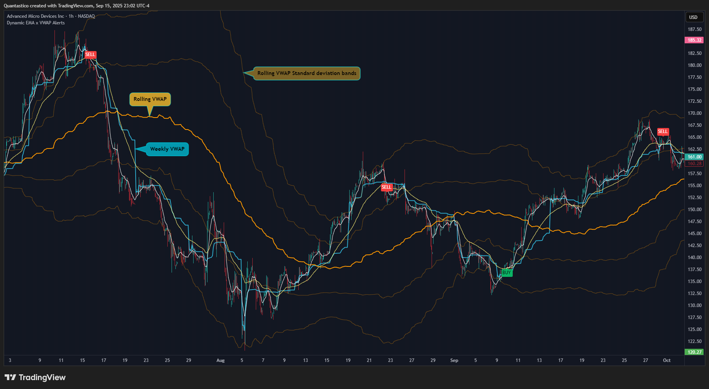
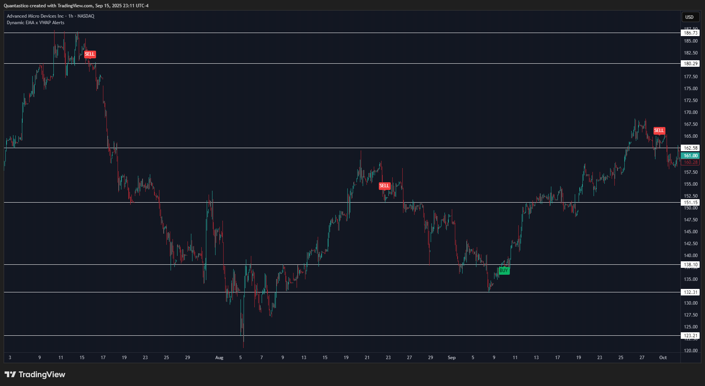

# Intraday Trading Tools

---

I am building a focused set of indicators for **day trading**. Based on user requests, I am packaging the first release (**Dynamic EMA x VWAP Alerts**) for **TradingView** (invite-only) and preparing a **NinjaTrader** port. My immediate priority is **usability and accuracy** (clear plots, one-shot alerts, minimal noise). After that, I’ll run a short **test-user validation** phase.

This repo is for **product updates and access logistics**.  
For access email **hello@quantastico.com** or dm via Tradinview: **https://www.tradingview.com/script/wF5AdhHK-Dynamic-EMA-x-VWAP-Alerts/**

---

## Dynamic EMA x VWAP Alerts — What it does

**EMA selection**  
`Fast EMA`, `Medium EMA`, `Slow EMA (0 = off)`, `Cross mode (Double/Triple)`

**VWAP selection**  
`Daily Anchored VWAP` (±1s, ±2s, ±3s)  
`Weekly Anchored VWAP` (±1s, ±2s, ±3s)  
`Rolling VWAP` (±1s, ±2s, ±3s), `Rolling VWAP length (bars)`

**Alert Gates**  
`Gate Mode` (Single / AND (Both) / OR (Either))  
`Gate A Source` (Daily / Weekly / Rolling) · `Gate B Source` (Daily / Weekly / Rolling)  
`Buy Gate Level` (VWAP / -1s / -2s) · `Sell Gate Level` (VWAP / +1s / +2s)

**RVOL**  
`Lookback bars`, `Lookback days`, `Min RVOL`

**Deviation**  
`Activate deviation threshold`, `Deviation threshold (%)`

**ATR**  
`Activate ATR gate`, `ATR length`, `Minimum ATR (%)`, `Maximum ATR (%) (0 = off)`,  
`Relative regime (ATR vs baseline)`, `Baseline length`, `Min ratio ×`, `Max ratio ×`

**Time windows**  
`Activate Time Windows`, timezone selector, `Active window`,  
`Enable Blackout #1/#2/#3`, `Show blackout info (preview)`

**Other**  
`Price source` (HL2 / HLC3 / Close)

---

## Screenshots

**Intraday (unfiltered)** — raw EMA crosses with VWAP context.  

**Intraday (filtered)** — same chart with gates active to cut noise.  

**Swing example** — higher-timeframe usage for context.  

**Engine illustration** — schematic view of the EMA/VWAP signal engine.  

**Swing case (support/resistance)** — showing VWAP bands guiding entries.  

**BTC example (pre-filtering)** — many raw signals without calibration filters.  

**BTC example (post-calibration filtering)** — fewer, higher-quality signals after ML-calibrated filters are applied.  

---

## 🧾 Evidence (MES · 1m & 3m · long-only)

**Baseline (no gating):** ~13.5k trades, ~50.7% win, **+0.135 pts/trade** expectancy.  
**Calibrated ranking (OOS probs + post-training calibration)** isolates higher-quality subsets.

### Calibrated selection levels — credit-style grades (no thresholds shown)

**1-minute**

| Grade | Trades | Win % | Exp pts/trade |
|---|---:|---:|---:|
| **CCC** | 1325 | 64.15% | 3.20 |
| **CC**  | 832  | 67.19% | 3.75 |
| **C**   | 516  | 70.54% | 4.38 |
| **B**   | 310  | 72.58% | 4.65 |
| **A**   | 32   | 78.12% | 5.63 |
| **AA**  | 8    | 87.50% | 7.50 |
| **AAA** | 8    | 87.50% | 7.50 |

**3-minute**

| Grade | Trades | Win % | Exp pts/trade |
|---|---:|---:|---:|
| **CCC** | 793 | 69.74% | 4.67 |
| **CC**  | 520 | 76.15% | 5.77 |
| **C**   | 515 | 76.31% | 5.81 |
| **B**   | 195 | 90.77% | 8.46 |
| **BB**  | 195 | 90.77% | 8.46 |
| **BBB** | 182 | 91.76% | 8.68 |
| **A**   | 182 | 91.76% | 8.68 |
| **AA**  | 182 | 91.76% | 8.68 |
| **AAA** | 4   | 100.00% | 10.00 |

*Note:* Some adjacent grades share the same sample size due to gaps in the calibrated score distribution.

**Retention buckets (Top-K%)**  
A companion CSV lists **Top 50, 45, 40, 35, 30, 25, 20, 15, 10%** for **1m** and **3m** with columns:  
`timeframe, bucket_top_%, trades, win_%, exp_pts_per_trade`.  
See `reports/EVIDENCE_MES_long_retention_buckets.csv`.

---

## 🧪 Initial Small Backtesting on Prototype Indicator

**Validated EMA/VWAP Crossover Buy Signal (MES)**  
- 3-min bars · 2025-06-01 → 2025-08-14 · 14:30–22:00 Europe/Stockholm  
- TP 10 pts / SL 7.5 pts  
- Result: **+65 pts** total · **58.3% win** · **Sharpe 3.07** · **MaxDD 30 pts**  

**Validated EMA/VWAP Crossover Sell Signal (MES)**  
- 3-min bars · 2025-06-01 → 2025-08-14 · 14:30–22:00 Europe/Stockholm  
- TP 10 pts / SL 7.5 pts  
- Result: **+31.5 pts** total · **47.8% win** · **Sharpe 1.05** · **MaxDD 30 pts**  

**Interpreting These Results**  
- Test period: quiet summer regime, slight bullish index near all-time highs.  
- Implication: more false signals and headwind for shorts.  
- The chosen bracket (TP 10 / SL 7.5) is intentionally conservative.

---

## 🔭 Scope & Next Steps

- ✅ **Improving signal accuracy.**  
- ✅ **Expanding to more timeframes** (1m, 3m, 5m, 15m, 30m).  
- ✅ **Adapting to various market conditions** with deeper backtests on 2–5 years of historical data (incl. regime analysis).  
- ✅ **Adapting to multi-instrument use:** stocks, crypto, and commodities.  
- ✅ **Invite-only distribution via TradingView** (later: NinjaTrader port).  

---

## 📬 Access 

- **TradingView (indicator page):** [_Dynamic EMAxWVAP Alerts_  ](https://www.tradingview.com/script/wF5AdhHK-Dynamic-EMA-x-VWAP-Alerts/)

---

## 📝 Full reports / custom backtesting

For a **complete private report** or custom runs (backtesting and/or ML calibration services) for other instruments/timeframes, contact me on hello@quantastico.com 

---

## ⚖️ Legal

The tools, scripts, and indicators presented here are provided for educational and informational purposes only. They are not financial advice and should not be interpreted as investment recommendations, trading signals, or a solicitation to buy or sell any financial instrument.

All forms of trading and investing involve risk. The past performance of any security, strategy, or market condition does not guarantee future outcomes. Users are solely responsible for their own trading and investment decisions, including evaluating their financial situation, objectives, and risk tolerance.

By using this indicator, you acknowledge that you do so at your own risk. The author accepts no liability for any direct or indirect loss or damage—including, without limitation, loss of profits—that may arise from the use of, or reliance upon, this tool.
