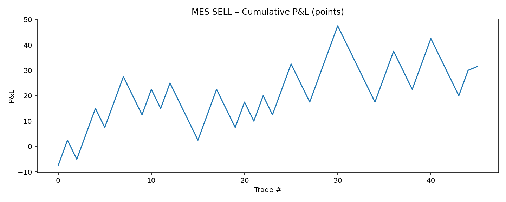

# Intraday Trading Tools 

This repo is for **product updates and access logistics**.  
No trading code or per-trade CSVs are published here.

---

## 📊 Executive Summary (showcase of the first backtest)

**Validated EMA/VWAP Crossover Buy Signal (MES)**  
- 3-min bars · 2025-06-01 → 2025-08-14 · 14:30–22:00 Europe/Stockholm  
- TP 10 pts / SL 7.5 pts  
- Result: **+65 pts** total · **58.3% win** · **Sharpe 3.07** · **MaxDD 30 pts**  

**Validated EMA/VWAP Crossover Sell Signal (MES)**  
- 3-min bars · 2025-06-01 → 2025-08-14 · 14:30–22:00 Europe/Stockholm  
- TP 10 pts / SL 7.5 pts  
- Result: **+31.5 pts** total · **47.8% win** · **Sharpe 1.05** · **MaxDD 30 pts**

**Interpreting These Results**  
- Test period: quiet summer regime, index near all-time highs.  
- Implication: more false signals and headwind for shorts.  
- The chosen bracket (TP 10 / SL 7.5) is intentionally conservative.

---

## 🔭 Scope & Next Steps
- Improving signal accuracy.  
- Expanding to more timeframes (1m, 3m, 5m, 15m, 30m).  
- Adapting to various market conditions with deeper backtests on 2–5 years of historical data.  
- Adapting to multi-instrument use: stocks, crypto, and commodities.  
- Invite-only distribution via TradingView (later: NinjaTrader port).  
- Early test users get ~70–90% discount in return for feedback.

➡️ **Details & waitlist instructions:** see [`products/emavwap-x.md`](products/emavwap-x.md)

---

## 📦 What this repo contains
- Product page(s) and sanitized reports/images  
- Announcements and updates  
- Contact instructions

## 🚫 What this repo does NOT contain
- No Pine or Python trading code  
- No per-trade CSVs or parameter dumps

---

## 👤 Author — **EmotionalTrader**
- From emotional → technical → quant trader. Trading futures while building ML models in Python.  
- [GitHub](https://github.com/EmotionalTrader)

---

## 📬 Contact
Email **sohail@creditive.com** with subject **“EMAVWAP-X Waitlist”**.  
Include your **TradingView username** and your **email** (only for updates/support; never shared; no spam).
